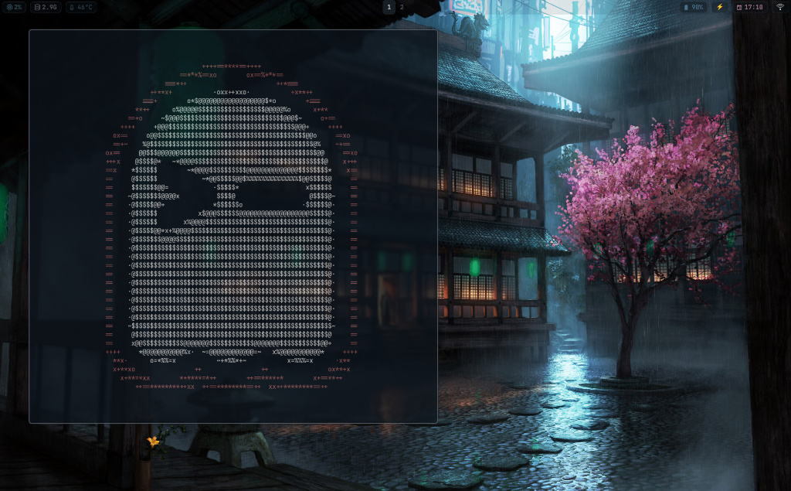
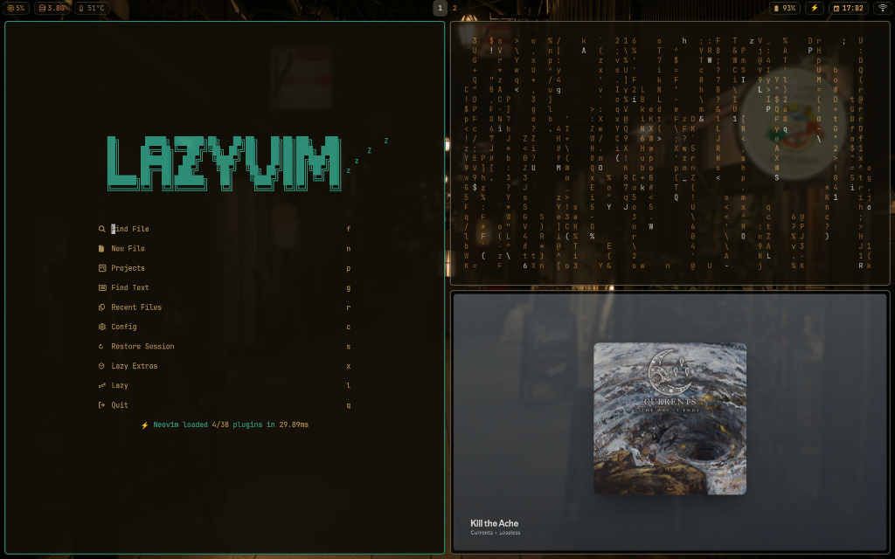
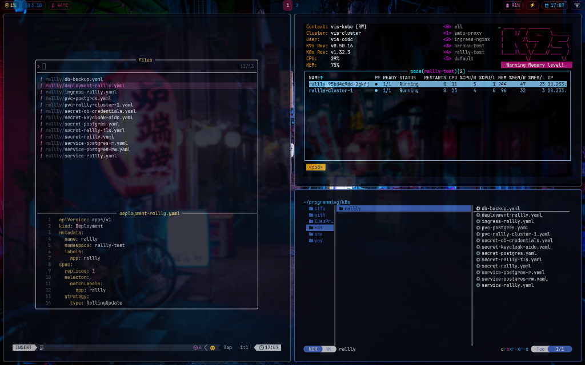

<div align="center">

# ⚡ .files
### A minimal, keyboard-centric Hyprland experience.

[](https://archlinux.org)
[](https://hyprland.org)
[](https://zsh.org)
[](https://github.com/dylanaraps/pywal)

<br />

[](https://gab-dev-7.github.io/dotfiles)

<p align="center">
  
</p>

</div>

---

## 📖 About

Welcome to my personal configuration files (dotfiles). This setup is built around **Hyprland** on **Arch Linux**, focusing on aesthetics, performance, and a keyboard-driven workflow.

The system uses **Pywal** to generate a consistent color scheme across the entire system (Waybar, Kitty, Rofi, Hyprland borders) based on your current wallpaper.

## 🚀 Features

- **WM:** [Hyprland](https://hyprland.org/) (Wayland) - Smooth animations & tiling.
- **Terminal:** [Kitty](https://sw.kovidgoyal.net/kitty/) - GPU accelerated.
- **Shell:** Zsh + [Starship](https://starship.rs/) prompt.
- **Bar:** [Waybar](https://github.com/Alexays/Waybar) - Highly customizable status bar.
- **Launcher:** Rofi (Wayland fork) or Wofi.
- **Editor:** [Neovim](https://neovim.io/) (Lua configuration).
- **Theming:** [Pywal](https://github.com/dylanaraps/pywal) - Automatic color generation from wallpapers.
- **Notifications:** Dunst / Mako.

---

## 📸 Gallery

|  |  |

---

## ⚡ Quick Start

**Full documentation, gallery, and detailed setup guide are available on the [Website](https://gab-dev-7.github.io/dotfiles).**

### Prerequisites
- A fresh install of **Arch Linux**.
- `git` installed.

### Installation
The included script will handle package installation and linking config files.

```bash
# 1. Update & Install Git
sudo pacman -Syu git

# 2. Clone the repository (Must be named 'dotfiles' for paths to work)
git clone [https://github.com/gab-dev-7/dotfiles.git](https://github.com/gab-dev-7/dotfiles.git) "$HOME/dotfiles"
cd "$HOME/dotfiles"

# 3. Run the installer
chmod +x install.sh
./install.sh
```

> **⚠️ Warning:** Back up your existing configurations (`~/.config`) before running the script!

---

## ⌨️ Keybindings

The workflow is heavily reliant on the `Super` (Windows) key. Here are the essentials:

| Key Combination | Action |
| :--- | :--- |
| `Super` + `Enter` | Open Terminal (Kitty) |
| `Super` + `Q` | Kill active window |
| `Super` + `Space` | Open App Launcher |
| `Super` + `E` | Open File Manager |
| `Super` + `F` | Toggle Fullscreen |
| `Super` + `Shift` + `F` | Toggle Floating |
| `Super` + `Left/Right` | Move focus |
| `Super` + `1-9` | Switch Workspace |

---

## 📂 Folder Structure

```graphql
$HOME/dotfiles
├── config/
│   ├── hypr/          # Window Manager Config
│   ├── kitty/         # Terminal Config
│   ├── nvim/          # Neovim Config
│   ├── waybar/        # Status Bar
│   └── zsh/           # Shell settings
├── scripts/           # Automation scripts
├── install.sh         # Main installation script
└── README.md
```

---

## 🎨 Customization

### Changing the Wallpaper & Theme
To change the wallpaper and update the system color scheme:

1. Place your image in `~/Pictures/Wallpapers/`.
2. Run the wallpaper script (or use the keybinding if configured):
   ```bash
   wal -i ~/Pictures/Wallpapers/your_image.jpg
   ```
3. Reload Hyprland (`Super` + `Shift` + `C` usually) to see changes.

---

## 🤝 Credits

- Inspired by the [Hyprland Community](https://github.com/hyprwm/Hyprland)
